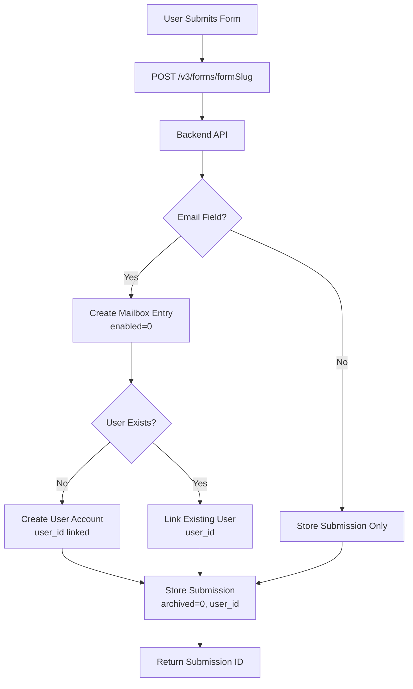
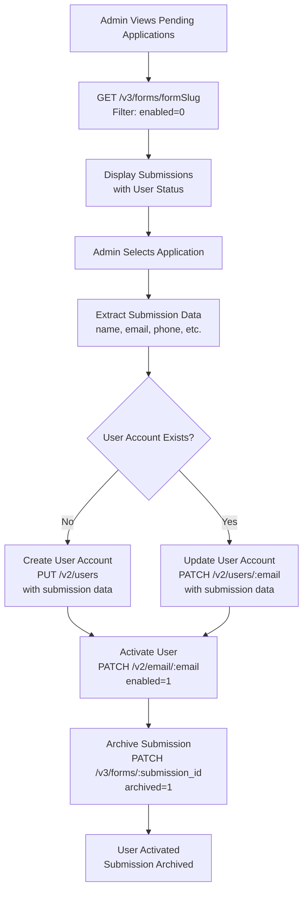

# Form Submission and User Activation Flow

## Current State

### Form Submission (Already Implemented)

- Forms submit to `POST /v3/forms/<formSlug>` via `formService.submitForm()`
- Backend automatically creates mailbox entry with `enabled=0` if email field exists
- Backend may create/link `user_id` if email exists
- Submission stored with `archived=0` by default
- Note: In the future, approved and activated users will be able to list their own submissions

### Missing Pieces

- Admin interface to view pending applications
- Approval workflow that transfers submission data to user account
- Automatic archiving after approval

## Data Flow Architecture

### 1. Form Submission Flow



**Implementation:**

- Already implemented in `src/services/formService.ts`
- Uses `POST /v3/forms/<formSlug>` endpoint
- Form data sent as form-encoded (URLSearchParams)

### 2. User Activation Flow



**Key Steps:**

1. Admin views pending applications (submissions where user has `enabled=0`)
2. Admin clicks "Approve" on a submission
3. System extracts ONLY user profile fields from submission (name, email, phone, dateOfBirth, location, gender, etc.)

   - Application-specific fields (e.g., "what makes you apply?") remain in submission

4. System checks if user account exists (via `user_id` in submission or `GET /v2/users/:email`)
5. If no user: Create user with `PUT /v2/users` using only profile fields
6. If user exists: Update user with `PATCH /v2/users/:email` using only profile fields
7. Activate user: `PATCH /v2/email/:email` with `enabled=1`
8. Archive submission: `PATCH /v3/forms/:submission_id` with `archived=1`

   - Submission retains all original fields (including application-specific ones)
   - Submission is linked to user via `user_id` for future reference

## Implementation Plan

### 1. Backend API Methods

**File:** `src/lib/backendApi.ts`

Add methods:

- `getFormSubmissions(formSlug: string, archived?: boolean)` - GET /v3/forms/:formSlug
- `archiveSubmission(submissionId: number)` - PATCH /v3/forms/:submissionId
- `createUserFromSubmission(data)` - PUT /v2/users (if needed, or use existing updateUser)

### 2. Admin Service Layer

**File:** `src/services/adminService.ts`

Add methods:

- `getPendingApplications(formSlug: string)` - Get submissions with enabled=0 users
- `approveApplication(submissionId: number, formSlug: string)` - Complete approval workflow:

  1. Get submission data
  2. Extract user fields (name, email, phone, etc.)
  3. Check/create/update user account
  4. Activate user
  5. Archive submission

- `rejectApplication(submissionId: number)` - Archive without activation

### 3. Admin API Routes

**File:** `src/app/api/admin/applications/route.ts`

- `GET` - Get pending applications (combines form submissions + user status)
- `POST` - Approve application (calls adminService.approveApplication)
- `DELETE` - Reject application (calls adminService.rejectApplication)

### 4. Admin UI Components

**File:** `src/components/portal/admin/PendingApplications.tsx`

- Display list of pending applications
- Show submission data (name, email, phone, etc.)
- Show user status (enabled=0, verified status)
- "Approve" button → triggers approval workflow
- "Reject" button → archives submission without activation

**File:** `src/components/portal/admin/ApplicationDetails.tsx`

- Detailed view of a single application
- Show all submission fields
- Show linked user info (if exists)
- Approve/Reject actions

### 5. Data Mapping

**Important:** Only user profile fields are transferred to the user account. Application-specific fields (like "what makes you apply to this course?") remain in the submission and are linked to the user via `user_id`.

**Submission Field → User Field Mapping (Only these fields are transferred):**

- `email` → `email` (required)
- `name` / `namn` → `name`
- `phone` / `mobilnummer` → `phone`
- `dateOfBirth` / `födelsedatum` → `dateOfBirth`
- `location` / `vart är du baserad` → `location`
- `gender` / `kön` → `gender`

**Fields that stay in submission only:**

- Application-specific questions (e.g., "what makes you apply to this course?")
- Form-specific fields not part of user profile
- Any custom fields added by editors

**File:** `src/utils/admin/submissionMapper.ts`

- `mapSubmissionToUserData(submission: FormSubmission): Partial<User>`
- Only maps known user profile fields (whitelist approach)
- Ignores application-specific fields (they stay in submission)
- Handles field name variations (Swedish/English)
- Validates required fields (email is required)
- Returns only fields that belong in user profile

**Whitelist of user profile fields:**

```typescript
const USER_PROFILE_FIELDS = [
  'email',
  'name', 'namn',
  'phone', 'mobilnummer', 'telefon',
  'dateOfBirth', 'födelsedatum', 'birthdate',
  'location', 'vart är du baserad',
  'gender', 'kön',
  // Add more as user profile schema expands
];
```

**Implementation:**

- Only extract fields that match the whitelist
- All other fields remain in the submission
- Submission is linked to user via `user_id` (set by backend when email exists)

## Implementation Details

### Approval Workflow Function

```typescript
// src/services/adminService.ts
async function approveApplication(
  submissionId: number,
  formSlug: string
): Promise<void> {
  // 1. Get submission
  const submission = await getFormSubmission(submissionId, formSlug);
  
  // 2. Extract ONLY user profile fields from submission
  // Application-specific fields remain in submission
  const userData = mapSubmissionToUserData(submission.submission);
  
  // 3. Check if user exists
  const email = userData.email;
  if (!email) {
    throw new Error('Submission must contain an email field');
  }
  
  let userExists = false;
  try {
    await BackendAPI.getUserByEmail(email);
    userExists = true;
  } catch (error) {
    // User doesn't exist
  }
  
  // 4. Create or update user (only with profile fields)
  if (userExists) {
    await BackendAPI.updateUser(email, userData);
  } else {
    await BackendAPI.createUser(userData);
  }
  
  // 5. Activate user
  await BackendAPI.activateUser(email);
  
  // 6. Archive submission
  // Note: Submission still contains all original fields (including
  // application-specific ones) and is linked to user via user_id
  await BackendAPI.archiveSubmission(submissionId);
}
```

### Error Handling

- If user creation fails → rollback, show error
- If activation fails → rollback user creation, show error
- If archiving fails → log warning but don't rollback (user is already activated)

## Files to Create/Modify

1. **`src/lib/backendApi.ts`** - Add `getFormSubmissions`, `archiveSubmission`
2. **`src/services/adminService.ts`** - Add approval workflow methods
3. **`src/app/api/admin/applications/route.ts`** - New API route for applications
4. **`src/utils/admin/submissionMapper.ts`** - Map submission data to user fields
5. **`src/components/portal/admin/PendingApplications.tsx`** - UI component
6. **`src/components/portal/admin/ApplicationDetails.tsx`** - Detail view component
7. **`src/app/(frontend)/(portal)/admin/applications/page.tsx`** - Admin page

## Testing Considerations

- Test with submission that has all user profile fields
- Test with submission containing application-specific fields (should remain in submission)
- Test with submission missing optional profile fields
- Test with existing user (should update, not create)
- Test with new user (should create)
- Test that application-specific fields are NOT transferred to user profile
- Test that submission retains all original fields after approval
- Test that submission is linked to user via `user_id`
- Test error scenarios (network failures, validation errors)
- Test that submission is archived after approval
- Test that user can sign in after activation